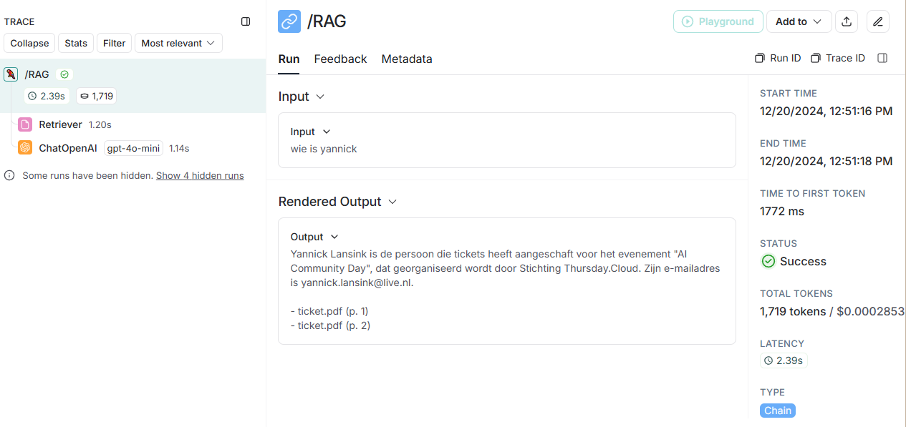

# Backend Structure Document (RAG-Service)

## Overzicht

**Doel van de Backend:**  
De backend van de RAG-service is ontworpen om de chatapplicatie te ondersteunen die medewerkers van Integratie Business Services (IBS) Toeslagen helpt bij het vinden van informatie. De backend verwerkt verzoeken, voert zoekopdrachten uit in een vector database, en genereert antwoorden met behulp van een Large Language Model (LLM).

## Belangrijke Functionaliteiten

- **Opslaan van documenten:** Documenten worden geüpload naar Azure Blob Storage.
- **API-calls:** Verzoeken van de frontend worden verwerkt en beantwoord via API-endpoints.
- **Vector Database:** Opslaan en doorzoeken van vectorrepresentaties van documenten.
- **Embeddings genereren:** Genereren van embeddings voor documenten met behulp van OpenAI. Hiervoor wordt een azure function gebruikt.
- **Chatgeschiedenis:** Opslaan en ophalen van chatgeschiedenis in de browser's localStorage.

## Technologiestack

- **Programmeertaal:** Python
- **Web Framework:** FastAPI
- **Vector Database:** Pinecone
- **Embeddings:** OpenAI
- **Cloud Storage:** Azure Blob Storage
- **Dependency Management:** Poetry en requirements.txt files

## Architectuur

### Belangrijke Componenten

- **FastAPI:** Voor het opzetten van de API-server en het verwerken van verzoeken.
- **Pinecone:** Voor het opslaan en doorzoeken van vectorrepresentaties van documenten.
- **OpenAI:** Voor het genereren van embeddings en het beantwoorden van vragen.
- **Azure Blob Storage:** Voor het opslaan van geüploade documenten.
- **LangChain:** Voor het opzetten van de keten van bewerkingen die nodig zijn om een antwoord te genereren.

### Third-Party Integraties

- **Azure:** Voor blob storage.
- **Pinecone:** Voor vector database functionaliteit.
- **OpenAI:** Voor het genereren van embeddings en het beantwoorden van vragen.

## API Specificaties

### Endpoints

- `GET /`: Redirect naar de API-documentatie.
- `POST /RAG/stream`: Verwerkt een vraag en streamt het antwoord terug naar de client.

## Database Structuur

### Vector Database

- **Pinecone:** Slaat vectorrepresentaties van documenten op. Deze vectoren worden gebruikt om snel relevante informatie te vinden op basis van de semantische inhoud van de vraag.

### Wat slaan we op

- **Documenten:** Geüploade documenten worden opgeslagen in Azure Blob Storage voor een tijdelijke duur.
- **Embeddings:** Vectorrepresentaties van documenten worden opgeslagen in Pinecone.
- **Chatgeschiedenis:** Opslaan van chatgeschiedenis in de browser's localStorage.

## Azure Function

### Waarom we deze gebruiken

Azure Functions worden gebruikt om serverless computing mogelijk te maken, wat schaalbaarheid en kostenbesparing biedt. Ze worden gebruikt om specifieke taken uit te voeren, zoals het verwerken van geüploade bestanden.

### Hoe het werkt met triggers

Azure Functions worden geactiveerd door triggers, zoals het uploaden van een bestand naar een specifieke container in Azure Blob Storage. Wanneer een bestand wordt geüpload, wordt de functie geactiveerd om het bestand te verwerken en op te slaan.

## Monitoring en Logging

### Hoe loggen we met LangSmith

LangSmith is een tool die wordt gebruikt voor het loggen en monitoren van API-aanroepen naar een Large Language Model (LLM). Het helpt bij het bijhouden van de keten van bewerkingen die worden uitgevoerd om een antwoord te genereren. Dit omvat het loggen van verzoeken, antwoorden en eventuele fouten die optreden tijdens de verwerking. Hierdoor kunnen ontwikkelaars beter inzicht krijgen in de prestaties en betrouwbaarheid van hun LLM-integraties.

**Voorbeeldcode voor logging:**

Dit Backend Structure Document biedt een overzicht van de doelstellingen, technologieën, architectuur, API-specificaties, database-structuur, Azure Functions, en monitoring en logging van de RAG-service.
