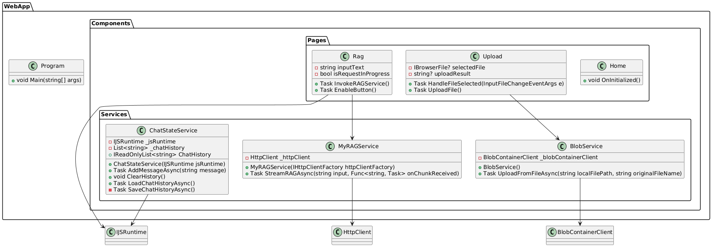
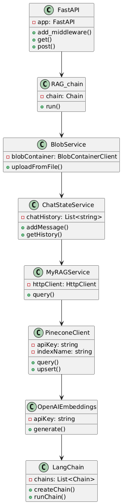
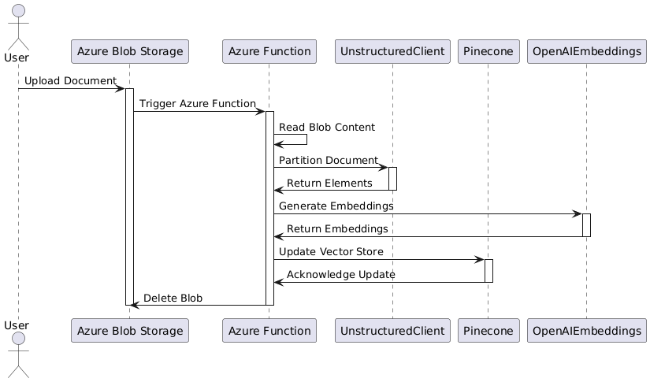
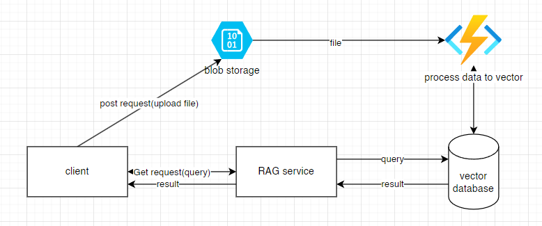
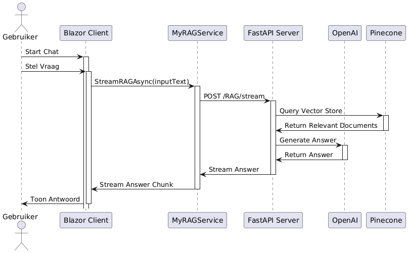
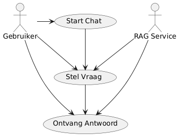
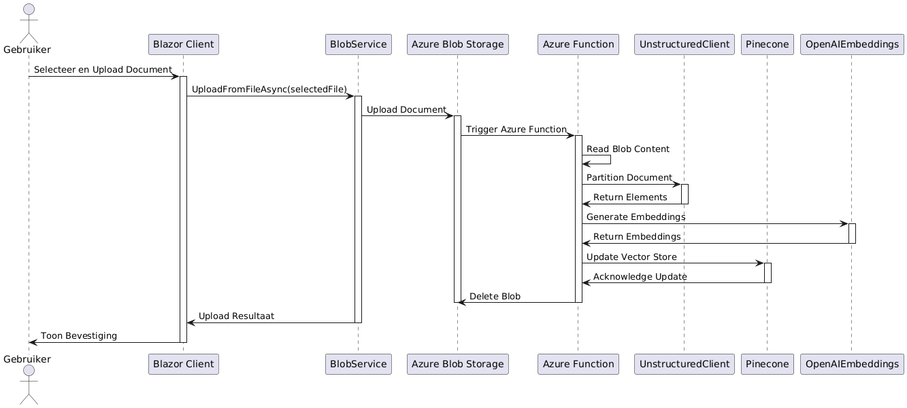
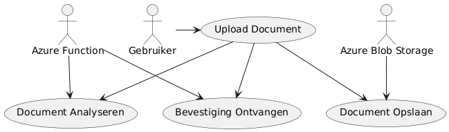

# Technisch Ontwerp Document (RAG-Service)

## Overzicht

**Doel van de Tech Stack:** De gekozen tech stack is ontworpen om een efficiënte, schaalbare en veilige chatapplicatie te ondersteunen die medewerkers van Integratie Business Services (IBS) Toeslagen helpt bij het vinden van informatie. De tech stack omvat zowel frontend- als backend-technologieën, hostingoplossingen en beveiligingsmaatregelen om een robuuste en gebruiksvriendelijke applicatie te leveren.

## Belangrijke Kern Functionaliteiten uitgewerkt in passende technische requirements

### Technische Requirements

#### Documentbeheer en Slimme Opslag

- **TR1.1:** Gebruik van het `InputFile` component in Blazor voor het selecteren en uploaden van bestanden, waarbij de component robuust moet omgaan met verschillende bestandsformaten en foutafhandeling.
- **TR1.2:** Implementatie van een `BlobService` in C# om bestanden efficiënt en veilig naar Azure Blob Storage te uploaden.
- **TR1.3:** Configuratie van `FormOptions` in `Program.cs` om de maximale bestandsgrootte te beperken tot 10 MB, met duidelijke foutmeldingen voor gebruikers bij overschrijding.
- **TR1.4:** Gebruik van Azure Blob Storage voor het opslaan van geüploade documenten, waarbij gebruik wordt gemaakt van versleuteling en toegangsbeheer om de veiligheid van de data te waarborgen.
- **TR1.5:** Bestanden worden tijdelijk opgeslagen in Azure Blob Storage. Ze worden tijdelijk opgeslagen met een levensduur van 1 uur voordat ze automatisch worden verwijderd. Tijdens deze periode worden de bestanden versleuteld met industriestandaard encryptieprotocollen zoals TLS voor transport.

#### Realtime Vraag-Antwoord API

- **TR2.1:** Implementatie van API-endpoints in FastAPI voor het verwerken van vragen, met ondersteuning voor schaalbaarheid en foutafhandeling.
- **TR2.2:** Gebruik van OpenAI voor het genereren van antwoorden op basis van de documenten, waarbij de API efficiënt moet omgaan met grote hoeveelheden data en complexe queries.
- **TR2.3:** Integratie met Pinecone voor het doorzoeken van vectorrepresentaties van documenten, waarbij de zoekalgoritmen geoptimaliseerd zijn voor snelheid en nauwkeurigheid.
- **TR2.4:** Gebruik van streaming API's om berichten terug te sturen naar de frontend, zodat de gebruiker constant wordt bijgewerkt met real-time informatie, met een focus op lage latentie en betrouwbaarheid.

#### Slimme Document Zoekfunctie

- **TR3.1:** Implementatie van een zoekfunctionaliteit in de frontend om documenten op te halen uit de vector database, met een intuïtieve gebruikersinterface en snelle responstijden.
- **TR3.2:** Gebruik van Pinecone voor het doorzoeken van vectorrepresentaties van documenten, waarbij de zoekresultaten semantisch relevant en nauwkeurig moeten zijn.
- **TR3.3:** Integratie met OpenAI voor het genereren van embeddings en het uitvoeren van semantische zoekopdrachten, met een focus op hoge precisie en recall.

#### Automatische Documentanalyse met Embeddings

- **TR4.1:** Gebruik van Azure Functions om een trigger te activeren bij het uploaden van een document, met een focus op betrouwbaarheid en schaalbaarheid.
- **TR4.2:** Implementatie van een Python script (`function_app.py`) om de documenten te analyseren en embeddings te genereren, waarbij gebruik wordt gemaakt van efficiënte en nauwkeurige AI-modellen.
- **TR4.3:** Integratie met Pinecone voor het opslaan van de gegenereerde embeddings, met een focus op snelle opslag en retrieval.
- **TR4.4:** Gebruik van OpenAI voor het genereren van embeddings, waarbij de modellen geoptimaliseerd zijn voor de specifieke documenttypes en zoekopdrachten.
- **TR4.5:** Opsplitsing van documenten in chunks voor efficiënte opslag en verwerking van embeddings, met aandacht voor gegevensintegriteit en schaalbaarheid.
- **TR4.6:** Implementatie van een mechanisme voor de controle en normalisatie van bestandsnamen om ervoor te zorgen dat bestanden met identieke namen worden overschreven. Dit voorkomt veroudering van data en waarborgt de consistentie en actualiteit van de opgeslagen informatie.

#### Persoonlijke Chatervaring met Geschiedenis

- **TR5.1:** Implementatie van een chatinterface in Blazor voor het voeren van gesprekken, met een focus op gebruiksvriendelijkheid en responsiviteit.
- **TR5.2:** Gebruik van `localStorage` in de browser voor het opslaan van de chatgeschiedenis, met aandacht voor gegevensintegriteit en beveiliging.
- **TR5.3:** Implementatie van een `ChatStateService` in C# om de chatgeschiedenis te beheren, met ondersteuning voor synchronisatie en herstel bij fouten.
- **TR5.4:** Gebruik van JavaScript interop (`IJSRuntime`) om de chatgeschiedenis op te slaan en op te halen uit `localStorage`, met een focus op prestaties en betrouwbaarheid.

## Technische Infrastructuur

### Frontend

### UML Class Diagram van de Frontend

### Uitleg van de Klassen

**ChatStateService:** Beheert de chatgeschiedenis.

- `IJSRuntime _jsRuntime:` Interface voor het uitvoeren van JavaScript-functies.
- `List<string> _chatHistory:` Lijst met chatgeschiedenis.
- `ChatStateService(IJSRuntime jsRuntime):` Constructor.
- `IReadOnlyList<string> ChatHistory:` Eigenschap voor het ophalen van de chatgeschiedenis.
- `Task AddMessageAsync(string message):` Voegt een bericht toe aan de chatgeschiedenis.
- `void ClearHistory():` Leegt de chatgeschiedenis.
- `Task LoadChatHistoryAsync():` Laadt de chatgeschiedenis.
- `Task SaveChatHistoryAsync():` Slaat de chatgeschiedenis op.

**BlobService:** Beheert bestanden in Azure Blob Storage.

- `BlobContainerClient _blobContainerClient:` Client voor het beheren van blob containers.
- `BlobService():` Constructor.
- `Task UploadFromFileAsync(string localFilePath, string originalFileName):` Uploadt een bestand naar Azure Blob Storage.

**MyRAGService:** Verwerkt vragen en haalt antwoorden op.

- `HttpClient _httpClient:` Client voor het uitvoeren van HTTP-aanvragen.
- `MyRAGService(IHttpClientFactory httpClientFactory):` Constructor.
- `Task StreamRAGAsync(string input, Func<string, Task> onChunkReceived):` Verwerkt een vraag en haalt een antwoord op.

**Home:** Beheert de homepagina.

- `void OnInitialized():` Methode die wordt aangeroepen bij initialisatie.

**Rag:** Beheert de RAG-invoegpagina.

- `string inputText:` Invoertekst voor de vraag.
- `bool isRequestInProgress:` Geeft aan of er een verzoek in behandeling is.
- `Task InvokeRAGService():` Roept de RAG-service aan.
- `Task EnableButton():` Schakelt de knop in.

**Upload:** Beheert de uploadpagina.

- `IBrowserFile? selectedFile:` Geselecteerd bestand.
- `string? uploadResult:` Resultaat van de upload.
- `Task HandleFileSelected(InputFileChangeEventArgs e):` Handelt de bestandsselectie af.
- `Task UploadFile():` Uploadt het bestand.

**Program:** Beheert de hoofdprogramma-initialisatie.

- `void Main(string[] args):` Hoofdprogramma-initialisatie.

---

**Programmeertaal:**

- C#

**Frameworks:**

- Blazor WebAssembly: Voor het bouwen van interactieve webapplicaties met behulp van C# en .NET.

**Styling:**

- CSS: Voor het stylen van de gebruikersinterface.
- Bootstrap: Voor het gebruik van kant-en-klare stijlen en componenten.

**Build Tools:**

- .NET SDK: Voor het bouwen en publiceren van de Blazor WebAssembly applicatie.

### Backend

### UML Class Diagram van de Backend Service

### Uitleg van de Klassen

**FastAPI:** De hoofdklasse voor het opzetten van de API-server en het verwerken van verzoeken.

- `add_middleware()`: Voegt middleware toe aan de applicatie.
- `get()`: Definieert een GET-endpoint.
- `post()`: Definieert een POST-endpoint.

**RAG_chain:** De klasse die de keten van bewerkingen definieert voor het verwerken van vragen en het genereren van antwoorden.

- `run()`: Voert de keten van bewerkingen uit.

**BlobService:** De klasse voor het beheren van bestanden in Azure Blob Storage.

- `uploadFromFile()`: Uploadt een bestand naar Azure Blob Storage.

**ChatStateService:** De klasse voor het beheren van de chatgeschiedenis.

- `addMessage()`: Voegt een bericht toe aan de chatgeschiedenis.
- `getHistory()`: Haalt de chatgeschiedenis op.

**MyRAGService:** De klasse voor het verwerken van vragen en het ophalen van antwoorden.

- `query()`: Verwerkt een vraag en haalt een antwoord op.

**PineconeClient:** De klasse voor het beheren van de Pinecone vector database.

- `query()`: Voert een query uit op de Pinecone database.
- `upsert()`: Voegt nieuwe vectoren toe aan de Pinecone database.

**OpenAIEmbeddings:** De klasse voor het genereren van embeddings met behulp van OpenAI.

- `generate()`: Genereert embeddings voor een gegeven tekst.

**LangChain:** De klasse voor het beheren van ketens van bewerkingen.

- `createChain()`: Maakt een nieuwe keten van bewerkingen.
- `runChain()`: Voert een keten van bewerkingen uit.

---

**Programmeertaal:**

- Python

**Frameworks:**

- FastAPI: Voor het opzetten van de API-server en het verwerken van verzoeken.
- LangChain: Voor het opzetten van de keten van bewerkingen die nodig zijn om een antwoord te genereren.
- Uvicorn: ASGI server voor het draaien van de FastAPI applicatie.

**Database:**

- Pinecone: Voor het opslaan en doorzoeken van vectorrepresentaties van documenten.

### Hosting en Azure function

**Azure Functie:**

#### Sequence diagram azure function

#### Uitleg van de Interacties

1. **User -> BlobStorage: Upload Document**

   - De gebruiker uploadt een document naar Azure Blob Storage.

2. **BlobStorage -> FunctionApp: Trigger Azure Function**

   - Azure Blob Storage triggert de Azure Function wanneer een nieuw document wordt geüpload.

3. **FunctionApp -> FunctionApp: Read Blob Content**

   - De Azure Function leest de inhoud van het geüploade document.

4. **FunctionApp -> UnstructuredClient: Partition Document**

   - De Azure Function roept de UnstructuredClient aan om het document te partitioneren.

5. **UnstructuredClient -> FunctionApp: Return Elements**

   - De UnstructuredClient retourneert de gepartitioneerde elementen van het document.

6. **FunctionApp -> OpenAIEmbeddings: Generate Embeddings**

   - De Azure Function roept OpenAIEmbeddings aan om embeddings te genereren voor de gepartitioneerde elementen.

7. **OpenAIEmbeddings -> FunctionApp: Return Embeddings**

   - OpenAIEmbeddings retourneert de gegenereerde embeddings.

8. **FunctionApp -> Pinecone: Update Vector Store**

   - De Azure Function roept Pinecone aan om de vector store bij te werken met de nieuwe embeddings.

9. **Pinecone -> FunctionApp: Acknowledge Update**

   - Pinecone bevestigt de update van de vector store.

10. **FunctionApp -> BlobStorage: Delete Blob**
    - De Azure Function verwijdert het geüploade document uit Azure Blob Storage.

- **Azure Functions:** Voor het uitvoeren van serverless functies die specifieke taken uitvoeren, zoals het verwerken van geüploade bestanden.

**Vector Database:**

- Pinecone: Voor het hosten van de vector database die wordt gebruikt voor het opslaan en doorzoeken van vectorrepresentaties van documenten.

**Source Code:**

- GitHub: Voor het beheren van de broncode en versiebeheer.

**Azure Blob Storage:**

- Azure Blob Storage: Voor het opslaan van geüploade bestanden.

Hier een tekening van de componenten in het landschap en hoe ze met elkaar communiceren.

### Requirements sequences en use cases

#### Chat interactie

---

### Upload interactie

---

### Beveiliging

**Huidige status:** Momenteel wordt nog weinig gedaan op het gebied van beveiliging omdat het om een prototype gaat.

**Toekomstige maatregelen:** In de toekomst worden de volgende maatregelen genomen om ervoor te zorgen dat onze data veilig blijft:

- Data Encryptie: Alle data die wordt opgeslagen in Azure Blob Storage en Pinecone wordt versleuteld om ongeautoriseerde toegang te voorkomen.
- Veilige API-aanroepen: Gebruik van HTTPS voor alle API-aanroepen om ervoor te zorgen dat de data tijdens het transport wordt versleuteld.
- Beveiligingsprotocollen: Implementatie van strikte beveiligingsprotocollen en best practices om ervoor te zorgen dat gevoelige informatie niet toegankelijk is voor onbevoegde partijen.
- Regelmatige Beveiligingsaudits: Voeren van regelmatige beveiligingsaudits en penetratietests om potentiële kwetsbaarheden te identificeren en te verhelpen.
- Gebruik van Secure Credentials: Gebruik van veilige methoden voor het opslaan en beheren van API-sleutels en andere gevoelige informatie, zoals Azure Key Vault.
- LLM op eigen servers draaien: Het draaien van de Language Learning Models (LLM) op eigen servers om data in huis te houden.

Dit Tech Stack Document biedt een overzicht van de technologieën en beveiligingsmaatregelen die worden gebruikt voor de ontwikkeling en hosting van de chat app.

## Project risico's

### Risicoanalyse

Een risicoanalyse is essentieel om potentiële problemen te identificeren die de voortgang en het succes van het project kunnen beïnvloeden. Hieronder volgt een gedetailleerde risicoanalyse voor de ontwikkeling en implementatie van de RAG-service.

| Risico                                     | Impact    | Kans van optreden | Beheersmaatregelen                                                                                                                                                                                         |
| ------------------------------------------ | --------- | ----------------- | ---------------------------------------------------------------------------------------------------------------------------------------------------------------------------------------------------------- |
| Integratieproblemen met Pinecone en OpenAI | Hoog      | Middel            | Monitor en log de prestaties van de integraties met behulp van Langsmith om problemen vroegtijdig te detecteren en op te lossen.                                                                           |
| Schaalbaarheidsproblemen                   | Hoog      | Middel            | Optimaliseer de code en gebruik schaalbare cloud-oplossingen zoals Azure Functions en Blob Storage.                                                                                                        |
| Beveiligingslekken                         | Zeer hoog | Middel            | Gebruik voor het prototype geen gevoelige data en implementeer basisbeveiligingsmaatregelen om de impact van eventuele lekken te minimaliseren.                                                            |
| Onvoldoende Training van Gebruikers        | Middel    | Hoog              | Organiseer een demo bij IBS Toeslagen, waarbij gebruikers Toeslagen breed een voorproefje krijgen van de chatapplicatie. Dit stelt hen in staat om de functionaliteiten te verkennen en vragen te stellen. |
| Onvoldoende Ondersteuning en Onderhoud     | Hoog      | Middel            | Stel een dedicated ondersteuningsteam samen en zorg voor een duidelijk onderhoudsplan. Gebruik monitoringtools om problemen vroegtijdig te detecteren en op te lossen.                                     |
| Onrealistische Tijds- en Budgetramingen    | Hoog      | Middel            | Voer een grondige projectplanning uit en houd rekening met bufferperiodes voor onvoorziene problemen. Monitor de voortgang regelmatig en pas de planning indien nodig aan.                                 |
| Veranderende Projectvereisten              | Middel    | Hoog              | Gebruik een agile ontwikkelmethode om flexibel in te spelen op veranderende vereisten.                                                                                                                     |

De risicoanalyse identificeert verschillende potentiële risico's die de ontwikkeling en implementatie van de RAG-service kunnen beïnvloeden. Door deze risico's te identificeren en passende mitigatiestrategieën te implementeren, kan ik de impact van deze risico's minimaliseren en de kans op een succesvol project vergroten. Het is belangrijk om regelmatig de risico's te evalueren en de mitigatiestrategieën bij te werken om in te spelen op nieuwe uitdagingen en veranderingen in de projectomgeving.
